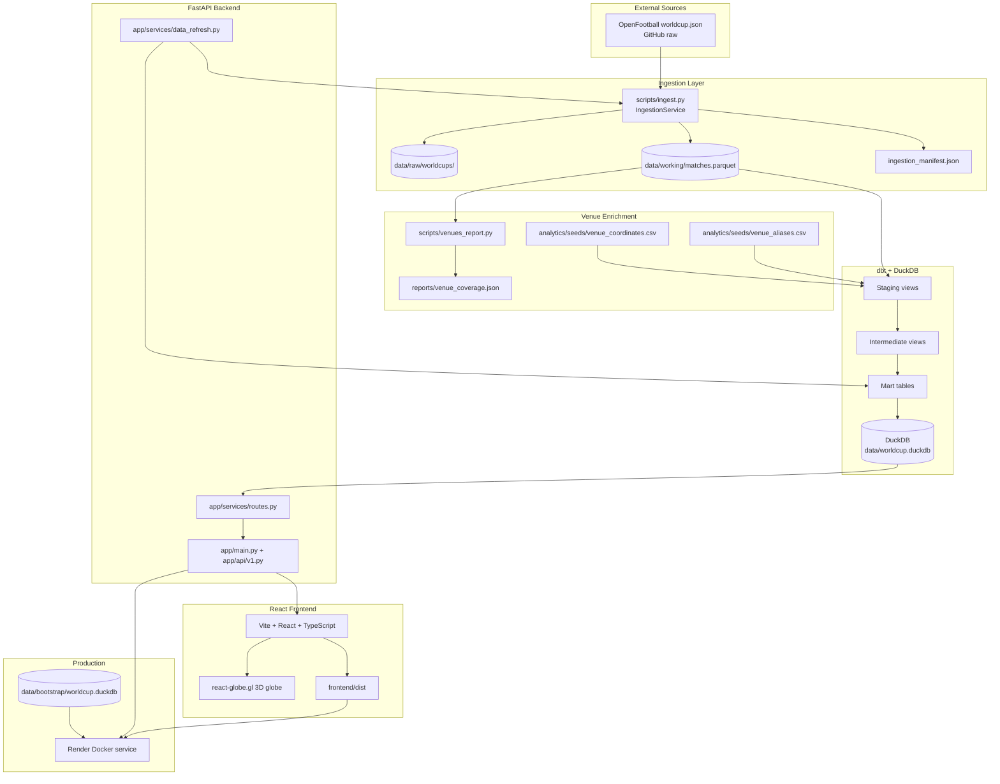

# World Cup Travel Atlas

Interactive web application for analyzing approximate match-location travel by national teams across FIFA Men's World Cup editions (1930–2026).

The app ingests match data from [OpenFootball](https://github.com/openfootball/worldcup.json), enriches venues with curated coordinates, computes great-circle travel distances with dbt, and serves an interactive 3D globe with itinerary tables and tournament leaderboards.

## Current dataset (verified)

| Metric | Value |
|--------|-------|
| Matches ingested | 1,069 |
| Tournament editions | 23 (1930–2026) |
| Distinct venues | 235 |
| Venue coordinate coverage | 100% (0 unresolved) |
| dbt build | 44/44 PASS |
| Python tests | 11 passed |
| Frontend unit tests | 9 passed |
| Frontend production build | succeeds |
| Docker build/startup (local) | verified with baseline and startup refresh |

## Architecture



See [docs/architecture.md](docs/architecture.md) for component-level detail.

## Data flow

1. **Download** — `IngestionService` fetches `worldcup.json` for each of 23 tournament years from OpenFootball GitHub raw URLs, with retries, checksums, and a manifest.
2. **Flatten** — JSON matches are normalized into a single `matches.parquet` (1,069 rows).
3. **Venue seed** — Curated coordinates in `analytics/seeds/venue_coordinates.csv` are joined via aliases; coverage is reported to `reports/venue_coverage.json`.
4. **Transform** — dbt builds staging → intermediate → mart models in DuckDB, computing Haversine legs and aggregates.
5. **Serve** — FastAPI reads the DuckDB marts read-only and exposes versioned JSON endpoints.
6. **Visualize** — The React SPA fetches routes, renders arcs on a 3D globe, and shows itinerary tables with CSV export.

On production startup, the runtime copies `data/bootstrap/worldcup.duckdb` to the writable DuckDB path. When `REFRESH_DATA_ON_START=true`, the full ingest → dbt pipeline runs and atomically replaces the runtime database.

## Metric definition

**Approximate match-location travel** is the sum of minimum great-circle (Haversine) distances between consecutive match locations in chronological order for a team within a tournament.

- Earth radius: **6,371.0088 km** (WGS84 mean)
- Legs with missing or `unresolved` coordinates are excluded from totals
- Same-stadium consecutive matches contribute **0 km**
- **Played scope** (`scope=played`): only completed fixtures
- **All scope** (`scope=all`): includes scheduled fixtures (e.g. 2026); projected distances are flagged

See [docs/methodology.md](docs/methodology.md) for formulas, edge cases, and data-quality rules.

## Data source and licensing

| Item | Detail |
|------|--------|
| Match data | [openfootball/worldcup.json](https://github.com/openfootball/worldcup.json) |
| Default ref | `master` (`OPENFOOTBALL_GITHUB_REF`) |
| URL pattern | `https://raw.githubusercontent.com/openfootball/worldcup.json/{ref}/{year}/worldcup.json` |
| Application license | MIT — see [LICENSE](LICENSE) |
| OpenFootball data | Public-domain style community dataset; verify upstream terms for redistribution |

Venue coordinates are manually curated in `scripts/venue_reference_data.json` and compiled into dbt seeds. They are not sourced from OpenFootball.

## Venue enrichment

235 distinct `(tournament_year, raw_ground)` pairs are resolved to latitude/longitude with precision labels (`stadium`, `city`, `metro`, `approximate`). Alias rows in `venue_aliases.csv` normalize spelling variants before lookup.

```bash
make venues-report   # writes reports/venue_coverage.json
```

See [docs/venue-enrichment.md](docs/venue-enrichment.md).

## Setup

**Prerequisites:** Python 3.12+, Node.js 22+, Make (or run equivalent commands manually).

```bash
git clone <repository-url>
cd Worldcuptravel
make install
```

`make install` creates a Python virtual environment (`.venv`), installs the package with dev extras (dbt, pytest, ruff, mypy), and runs `npm install` in `frontend/`.

Copy environment defaults if needed:

```bash
cp .env.example .env
```

On Windows, ingestion uses [`truststore`](https://github.com/sethmlarson/truststore) to inject OS certificate stores for HTTPS (corporate proxies / SSL issues).

## Local development

Full pipeline from scratch:

```bash
make install
make ingest          # download OpenFootball → parquet (1,069 matches)
make venues-report   # validate 235/235 venue coverage
make dbt-build       # 44 models/tests → data/worldcup.duckdb
```

Run the stack in **two terminals**:

```bash
# Terminal 1 — API on http://127.0.0.1:8000
make api

# Terminal 2 — Vite dev server (proxies /api to backend)
make frontend
```

**Production-style local run** (single process serves built SPA + API):

```bash
make build           # dbt-build + frontend production build
APP_ENV=production make api
```

Open http://127.0.0.1:8000 — the API serves `frontend/dist` as a SPA.

A pre-built baseline database ships at `data/bootstrap/worldcup.duckdb` for Docker/Render cold starts without a full refresh.

## dbt lineage summary

```
matches.parquet
  └── src_openfootball_matches
        └── stg_world_cup_matches
              └── stg_match_teams
                    └── int_match_locations  ← venue_coordinates, venue_aliases, team_aliases seeds
                          └── int_team_match_history
                                └── int_team_match_sequence
                                      └── int_team_travel_legs  ← haversine_km macro
                                            ├── fct_team_travel_legs
                                            ├── fct_team_match_appearances
                                            └── agg_team_tournament_travel
                                                  └── agg_tournament_travel_leaderboard

dim_venues, dim_teams, dim_tournaments, fct_matches, data_quality_venue_coverage
```

**44 dbt resources** (models + seeds + tests) — all pass on the current dataset.

See [docs/data-model.md](docs/data-model.md) for column-level documentation.

## API endpoints

Base URL: `/api/v1` (development: `http://127.0.0.1:8000`).

| Method | Path | Description |
|--------|------|-------------|
| `GET` | `/healthz` | Health check (`status`, `database_available`, `version`) |
| `GET` | `/api/v1/meta` | App version, source ref, freshness, coordinate coverage, metric definition |
| `GET` | `/api/v1/tournaments` | All tournaments with match/team counts and coverage |
| `GET` | `/api/v1/tournaments/{year}/teams` | Teams for a tournament year |
| `GET` | `/api/v1/routes?year=&team=&scope=` | Team route, legs, distances (`scope`: `played` \| `all`) |
| `GET` | `/api/v1/tournaments/{year}/leaderboard` | Travel distance rankings |
| `GET` | `/api/v1/venues/{venue_id}` | Venue detail and hosted matches |

Responses include `Cache-Control` headers (120–600 s). Errors return `{"detail": "..."}`.

## Testing

```bash
make test
```

| Suite | Count | Scope |
|-------|-------|-------|
| Python (`pytest tests`) | 9 passed | Ingestion helpers, Haversine, API integration (1930 Uruguay route) |
| Frontend (`vitest`) | 5 passed | Haversine util, route transform, TotalCounter component |
| dbt (`make dbt-build`) | 44/44 PASS | Schema tests + 8 singular SQL tests |
| Frontend build | succeeds | `tsc -b && vite build` |

CI (`.github/workflows/ci.yml`) runs lint, typecheck, fixture-based dbt build, all tests, frontend build, and Docker build on Ubuntu.

Optional E2E: `cd frontend && npm run test:e2e` (Playwright — not part of default `make test`).

## Render deployment

1. Push the repository to GitHub.
2. In [Render](https://render.com), create a **Blueprint** from `render.yaml`.
3. Deploy the `worldcup-travel-atlas` web service (Docker, free plan).
4. Verify: `GET https://<your-service>.onrender.com/healthz` → `{"status":"ok",...}`.

Key `render.yaml` settings:

| Variable | Value | Purpose |
|----------|-------|---------|
| `APP_ENV` | `production` | Serve built frontend from `frontend/dist` |
| `REFRESH_DATA_ON_START` | `true` | Refresh data on each deploy/start |
| `DUCKDB_PATH` | `/tmp/worldcup.duckdb` | Writable runtime DB (ephemeral disk) |
| `DUCKDB_BASELINE_PATH` | `/app/data/bootstrap/worldcup.duckdb` | Committed baseline for cold start |
| `healthCheckPath` | `/healthz` | Render health probe |

See [docs/deployment-render.md](docs/deployment-render.md) for exact steps, env vars, verification commands, and troubleshooting.

## Scheduled refresh

| Mechanism | Schedule | Action |
|-----------|----------|--------|
| `REFRESH_DATA_ON_START=true` | Each Render deploy/restart | Full ingest → dbt → atomic DB swap |
| `.github/workflows/refresh-render.yml` | Daily 06:00 UTC (cron) | POST to `RENDER_DEPLOY_HOOK_URL` secret |

The deploy hook triggers a new Render deploy, which re-runs the startup refresh pipeline.

## Known limitations

- **Not actual travel** — Distances are great-circle between venue coordinates, not flights, roads, or team base camps.
- **Venue precision varies** — Some rows use city/metro/approximate coordinates when stadium-level data is unavailable.
- **2026 fixtures** — Scheduled matches are included in `scope=all`; distances are projected until results exist.
- **Ephemeral disk on Render** — Runtime DuckDB lives on `/tmp`; data is rebuilt from baseline + refresh on each start.
- **Single-process architecture** — No separate worker; refresh runs synchronously at startup when enabled.

## Data quality

- **Venue coverage:** 235/235 resolved (100%) — see `reports/venue_coverage.json`
- **dbt singular tests:** non-negative distances, no self-legs, monotonic cumulative distance, unique legs/sequences, valid lat/lng, scheduled matches marked unplayed
- **API warnings:** Routes with unresolved coordinates (currently none) are flagged in `data_quality.warnings` and excluded from totals
- **Freshness:** `/api/v1/meta` sets `is_data_stale` when last download exceeds `DATA_FRESHNESS_WARNING_HOURS` (default 36 h)

## Screenshots

<!-- Add screenshots after capturing the running application -->

| View | File |
|------|------|
| 3D globe with route arcs | `docs/images/globe-route.png` *(placeholder)* |
| Tournament leaderboard | `docs/images/leaderboard.png` *(placeholder)* |
| Itinerary table + CSV export | `docs/images/itinerary.png` *(placeholder)* |
| Methodology drawer | `docs/images/methodology.png` *(placeholder)* |

## Future enhancements

- Playwright smoke tests in default CI gate
- Incremental ingestion (skip unchanged tournament JSON by checksum)
- Historical team name normalization expansion
- Offline PWA / cached routes for slow connections
- Export leaderboard as CSV/JSON
- Admin endpoint to trigger refresh without redeploy
- Verified local Docker Desktop workflow documentation

## Documentation index

| Document | Contents |
|----------|----------|
| [docs/architecture.md](docs/architecture.md) | Components, runtime lifecycle, directory layout |
| [docs/data-model.md](docs/data-model.md) | dbt models, seeds, tests, DuckDB tables |
| [docs/methodology.md](docs/methodology.md) | Distance metric, Haversine, scopes, exclusions |
| [docs/deployment-render.md](docs/deployment-render.md) | Render Blueprint, env vars, operations |
| [docs/venue-enrichment.md](docs/venue-enrichment.md) | Coordinate curation, aliases, coverage workflow |
| [PLAN.md](PLAN.md) | Original implementation checklist |
