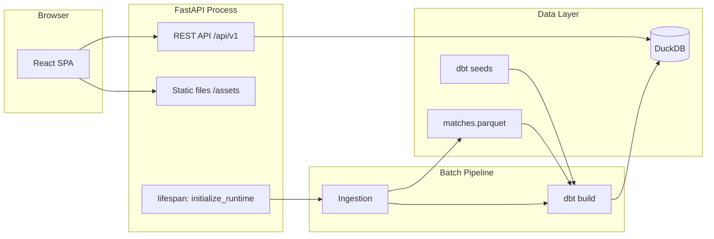
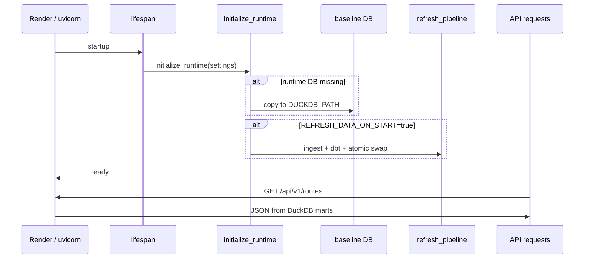

# Architecture

World Cup Travel Atlas is a monorepo with a Python data pipeline, dbt analytics layer, FastAPI backend, and React frontend served as a single deployable unit on Render.

## System overview



## Components

### Ingestion (`app/services/ingestion.py`, `scripts/ingest.py`)

- Downloads 23 tournament JSON files from OpenFootball GitHub raw
- Flattens nested match structures into a tabular schema
- Generates deterministic `match_id` hashes (SHA-256 truncated to 32 chars)
- Writes `data/raw/worldcups/{year}/worldcup.json`, `data/working/matches.parquet`, and `data/working/ingestion_manifest.json`
- Uses `httpx` with retries; on Windows, `truststore` injects OS CA certificates for SSL

**Verified scale:** 1,069 matches across 23 editions.

### Venue enrichment (`app/services/venue_enrichment.py`, `scripts/`)

- Maintains curated coordinates in dbt seed CSVs
- `build_full_venue_seed.py` compiles `scripts/venue_reference_data.json` into `analytics/seeds/venue_coordinates.csv`
- `venues_report.py` produces `reports/venue_coverage.json` and `reports/unmapped_venues.csv`

**Verified coverage:** 235 venues, 100% resolved.

### Analytics (`analytics/`)

- dbt-duckdb project targeting `data/worldcup.duckdb`
- Layered models: sources → staging → intermediate → marts
- Custom macros: `haversine_km`, `normalize_ground`
- 8 singular SQL tests plus schema tests on key columns

**Verified:** 44/44 dbt resources pass.

### API (`app/`)

| Module | Responsibility |
|--------|----------------|
| `main.py` | FastAPI app, `/healthz`, SPA static serving in production |
| `api/v1.py` | Versioned route handlers |
| `services/routes.py` | DuckDB queries, response assembly, data-quality warnings |
| `services/data_refresh.py` | Startup init, optional refresh pipeline, dbt orchestration |
| `database.py` | Read-only DuckDB connections |
| `settings.py` | Pydantic settings from env / `.env` |
| `schemas/api.py` | Response models |

### Frontend (`frontend/`)

- Vite + React 19 + TypeScript
- `react-globe.gl` + Three.js for 3D globe visualization
- `@tanstack/react-query` for API caching
- URL-synced filter state (tournament, team, scope)
- Components: `GlobeView`, `ControlsPanel`, `ItineraryTable`, `TotalCounter`, `DataQualityBanner`, `MethodologyDrawer`

Development: Vite dev server proxies `/api` to `http://127.0.0.1:8000` (see `VITE_API_PROXY_TARGET`).

Production: `frontend/dist` is copied into the Docker image and served by FastAPI with SPA fallback.

## Runtime lifecycle



### Database paths

| Path | Role |
|------|------|
| `data/bootstrap/worldcup.duckdb` | Committed baseline (Docker + cold start) |
| `data/worldcup.duckdb` | Local development runtime database |
| `/tmp/worldcup.duckdb` | Render writable runtime (ephemeral) |

Refresh builds into a temp file, then atomically replaces the runtime path (with `.bak` backup).

## Directory layout

```
Worldcuptravel/
├── app/                    # FastAPI application
├── analytics/              # dbt project
│   ├── models/             # staging, intermediate, marts
│   ├── seeds/              # venue_coordinates, venue_aliases, team_aliases
│   ├── macros/             # haversine_km, normalize_ground
│   └── tests/              # singular SQL tests
├── data/
│   ├── bootstrap/          # worldcup.duckdb baseline
│   ├── raw/worldcups/      # downloaded JSON per year
│   └── working/            # parquet, manifests, dbt meta
├── docs/                   # documentation
├── frontend/               # React SPA
├── reports/                # venue coverage reports
├── scripts/                # ingest, venue seed, reports
├── tests/                  # Python unit + integration tests
├── Dockerfile              # multi-stage: Node build + Python runtime
├── render.yaml             # Render Blueprint
├── start.sh                # production entrypoint (uvicorn)
└── Makefile                # local dev commands
```

## Deployment topology (Render)

```mermaid
flowchart TB
    GH[GitHub repo] -->|autoDeploy| R[Render Web Service]
    R --> D[Docker image]
    D --> U[uvicorn :10000]
    U --> H[/healthz]
    U --> API[/api/v1/*]
    U --> SPA[frontend/dist]
    CRON[GitHub cron workflow] -->|deploy hook| R
```

- **Runtime:** Docker (`python:3.12-slim` + built frontend)
- **Port:** `10000` (Render `PORT` env)
- **Health:** `/healthz` — checks DuckDB availability and latest tournament year
- **User:** non-root `appuser` (uid 10001)

## CI pipeline

`.github/workflows/ci.yml` on push/PR to `main`/`master`:

1. Python lint (ruff) + typecheck (mypy)
2. Fixture-only ingestion (`--local-only` with `tests/fixtures/worldcups/`)
3. dbt build on fixture parquet
4. pytest (9 tests)
5. Frontend lint, vitest (5 tests), production build
6. Docker build on Ubuntu

## Security and operational notes

- DuckDB connections are **read-only** for API handlers
- No authentication on public read endpoints (intended for public dataset visualization)
- `REFRESH_DATA_ON_START` performs outbound HTTPS only to OpenFootball GitHub raw
- Response size bounded at ingestion (`http_max_response_bytes`: 10 MB per tournament file)
- CORS not required in production (same-origin SPA); dev proxy handles cross-port requests

## Related documents

- [data-model.md](data-model.md) — table and model reference
- [methodology.md](methodology.md) — distance calculations
- [deployment-render.md](deployment-render.md) — production operations
- [venue-enrichment.md](venue-enrichment.md) — coordinate curation
