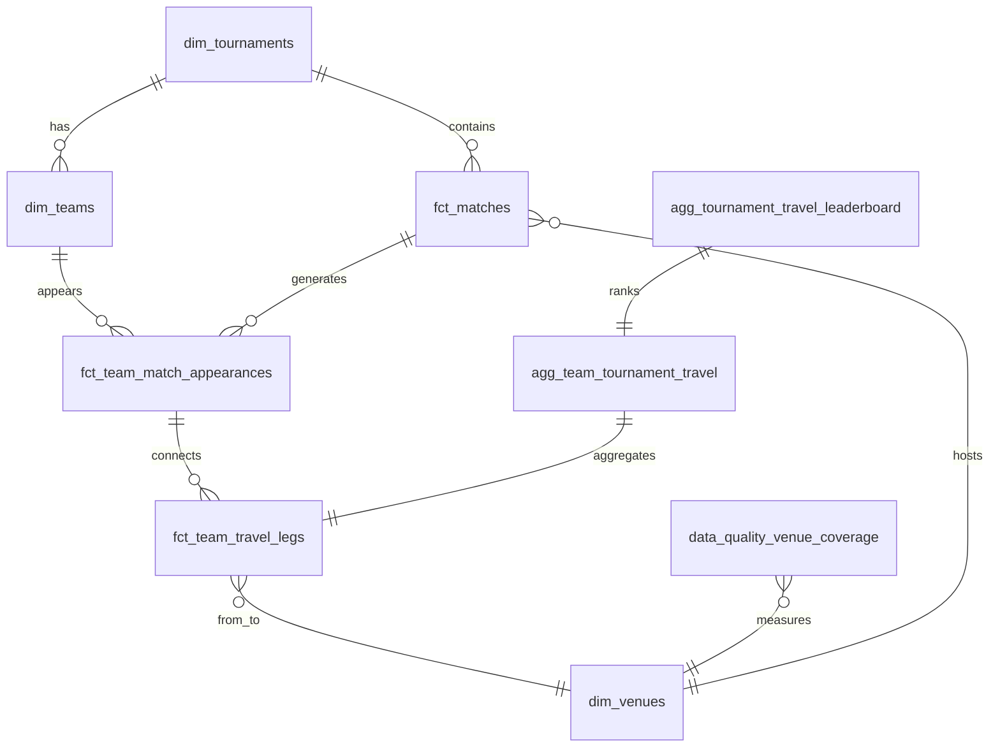

# Data Model

The analytics layer is a dbt project (`analytics/`) materialized into DuckDB. All API queries read from mart tables.

## Entity relationship (logical)



## Source layer

### `src_openfootball_matches` (view)

Reads `matches.parquet` via `read_parquet(env_var('MATCHES_PARQUET_PATH'))`.

**Upstream:** Python ingestion flattens OpenFootball JSON.

**Key columns:** `match_id`, `tournament_year`, `team1_name`, `team2_name`, `raw_ground`, `match_date`, `is_played`, `round_name`, score fields.

**Volume:** 1,069 rows (23 tournaments).

## Seeds

| Seed | Purpose |
|------|---------|
| `venue_coordinates` | Lat/lng per `(tournament_year, raw_ground)` — 235 rows |
| `venue_aliases` | Spelling normalizations before coordinate lookup |
| `team_aliases` | Canonical team IDs and display names |

Seeds are loaded by dbt `build` and referenced in `stg_venue_coordinates` and `stg_team_aliases`.

## Staging models (views)

| Model | Description |
|-------|-------------|
| `stg_world_cup_matches` | Type casting, column selection from source |
| `stg_match_teams` | Unpivots team1/team2 into one row per team appearance |
| `stg_venue_coordinates` | Normalized ground keys joined to seed coordinates |
| `stg_team_aliases` | Team name → canonical `team_id` |

## Intermediate models (views)

### `int_match_locations`

Joins match appearances with venue coordinates and team aliases. Produces `venue_id`, `latitude`, `longitude`, `coordinate_precision`, and `has_coordinates` boolean.

Resolution order:
1. Apply `venue_aliases` to canonicalize `raw_ground`
2. Join `stg_venue_coordinates` on `(tournament_year, normalized_ground)`
3. Apply `team_aliases` for `team_id` / `opponent_id`

### `int_team_match_history`

Chronological match history per `(tournament_year, team_id)` with opponent, result, and location fields.

### `int_team_match_sequence`

Adds `sequence_number` (1-based chronological order within tournament for each team).

### `int_team_travel_legs`

Computes consecutive-match legs:

| Column | Description |
|--------|-------------|
| `leg_number` | `sequence_number - 1` of destination match |
| `from_match_id` / `to_match_id` | Consecutive matches |
| `distance_km` | Haversine or 0 (same coords) or NULL (incomplete) |
| `is_coordinate_complete` | Both endpoints have resolved coordinates |
| `is_projected` | Either endpoint match is unplayed (scheduled) |
| `cumulative_distance_km` | Running sum of complete legs |

## Mart tables

### `dim_tournaments`

One row per World Cup edition: `tournament_year`, `tournament_name`, `match_count`, `played_match_count`.

### `dim_teams`

Distinct `(tournament_year, team_id, team_name)` from appearances.

### `dim_venues`

Resolved venues with `venue_id`, `canonical_venue_name`, `city`, `country`, `country_code`, coordinates, `coordinate_precision`, `raw_ground`.

### `fct_matches`

Match-level fact: both teams, date, round, venue, played status. One row per match (not per team).

### `fct_team_match_appearances`

One row per team per match. Includes `sequence_number`, opponent, result, venue coords, `cumulative_distance_km`, `is_played`.

**Grain:** `(tournament_year, team_id, match_id)`

### `fct_team_travel_legs`

One row per travel leg between consecutive matches.

**Grain:** `(tournament_year, team_id, leg_number)`

### `agg_team_tournament_travel`

Per-team tournament aggregates:

| Column | Description |
|--------|-------------|
| `total_distance_km` | Sum of complete legs (played + projected) |
| `completed_distance_km` | Legs where both matches are played |
| `projected_additional_distance_km` | Legs involving scheduled matches |
| `match_count` | Team appearances |
| `route_leg_count` | Number of legs |
| `unresolved_match_count` | Matches missing coordinates |
| `excluded_leg_count` | Legs with incomplete coordinates |

### `agg_tournament_travel_leaderboard`

Ranks teams by `total_distance_km` descending within each `tournament_year` (`travel_rank` via `row_number()`).

### `data_quality_venue_coverage`

Per-edition and global (`tournament_year = 0`) venue resolution stats: `total_venues`, `resolved_venues`, `unresolved_venues`, `coverage_pct`.

**Verified global row:** 235 total, 235 resolved, 0 unresolved, 100% coverage.

## dbt lineage (full)

```
read_parquet (matches.parquet)
└── src_openfootball_matches
    └── stg_world_cup_matches
        └── stg_match_teams
            └── int_match_locations
                ├── [seed] venue_coordinates → stg_venue_coordinates
                ├── [seed] venue_aliases
                ├── [seed] team_aliases → stg_team_aliases
                └── int_team_match_history
                    └── int_team_match_sequence
                        └── int_team_travel_legs
                            ├── fct_team_travel_legs
                            ├── fct_team_match_appearances
                            └── agg_team_tournament_travel
                                └── agg_tournament_travel_leaderboard

int_match_locations → dim_venues
int_team_match_history → dim_teams (distinct)
stg_world_cup_matches → dim_tournaments, fct_matches
int_match_locations → data_quality_venue_coverage
```

## dbt tests

### Schema tests (`schema.yml`)

- `stg_world_cup_matches.match_id`: unique, not_null
- `fct_team_match_appearances`: not_null on `match_id`, `tournament_year`, `team_id`, `sequence_number`
- `fct_team_travel_legs`: not_null on `leg_number`, `tournament_year`, `team_id`
- `dim_venues.venue_id`: not_null
- `stg_venue_coordinates.coordinate_precision`: accepted values

### Singular tests (`analytics/tests/`)

| Test | Assertion |
|------|-----------|
| `assert_nonnegative_distances` | All `distance_km >= 0` |
| `assert_no_self_legs` | No leg where from/to venue identical with distance > 0 |
| `assert_cumulative_distance_monotonic` | Cumulative distance never decreases |
| `assert_unique_travel_legs` | Unique `(tournament_year, team_id, leg_number)` |
| `assert_unique_team_sequences` | Unique `(tournament_year, team_id, sequence_number)` |
| `assert_legs_connect_consecutive_matches` | Leg endpoints match sequence order |
| `assert_valid_latitude` | Latitudes in [-90, 90] |
| `assert_valid_longitude` | Longitudes in [-180, 180] |
| `assert_scheduled_matches_not_played` | `is_played = false` for scheduled fixtures |

**Build result:** 44/44 PASS (models + seeds + tests).

## Working files (non-dbt)

| File | Contents |
|------|----------|
| `data/working/matches.parquet` | Ingested match table |
| `data/working/ingestion_manifest.json` | Download metadata, checksums, `total_matches: 1069` |
| `data/working/dbt_build_meta.json` | Last dbt build timestamp and success flag |
| `reports/venue_coverage.json` | Pre-dbt venue resolution report |
| `reports/unmapped_venues.csv` | Empty when coverage is 100% |

## API table usage

| Endpoint | Primary tables |
|----------|----------------|
| `/api/v1/meta` | `dim_tournaments`, `data_quality_venue_coverage` |
| `/api/v1/tournaments` | `dim_tournaments`, `dim_teams`, `data_quality_venue_coverage` |
| `/api/v1/tournaments/{year}/teams` | `fct_team_match_appearances` |
| `/api/v1/routes` | `fct_team_match_appearances`, `fct_team_travel_legs`, `dim_venues`, `agg_team_tournament_travel` |
| `/api/v1/tournaments/{year}/leaderboard` | `agg_tournament_travel_leaderboard` |
| `/api/v1/venues/{venue_id}` | `dim_venues`, `fct_matches` |

## Macros

### `haversine_km(lat1, lon1, lat2, lon2, radius=6371.0088)`

Standard great-circle distance in kilometres. Defined in `analytics/macros/haversine_km.sql`.

### `normalize_ground(expression)`

Lowercases, collapses whitespace, normalizes dash characters — must match Python `normalize_ground()` in `venue_enrichment.py`.
