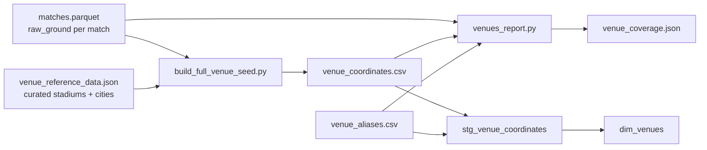

# Venue Enrichment

World Cup Travel Atlas resolves each match's `raw_ground` string from OpenFootball to geographic coordinates. This is a **curated, offline** process — coordinates are not geocoded at runtime.

## Overview



## Verified coverage

| Metric | Value |
|--------|-------|
| Distinct venues | 235 |
| Resolved | 235 |
| Unresolved | 0 |
| Coverage | 100% |

Per-edition breakdown is in `reports/venue_coverage.json` (generated 2026-07-15).

## Venue identity

A venue is uniquely identified by:

```
venue_id = sha256("{tournament_year}|{normalized_ground}")[:16]
```

Normalization (`normalize_ground`) lowercases, collapses whitespace, and standardizes dash characters. The same logic exists in:
- Python: `app/services/venue_enrichment.py`
- dbt: `analytics/macros/normalize_ground.sql`

**Important:** The same physical stadium may have different `venue_id` values across tournaments if `raw_ground` text differs by edition.

## Data files

### `scripts/venue_reference_data.json`

Curated reference with two lookup tables:

| Section | Keys | Use |
|---------|------|-----|
| `stadiums` | `{year}\|{normalized_ground}`, `0\|{norm}`, or `{norm}` | Stadium-level lat/lng |
| `cities` | normalized city name | City-centroid fallback |

Each entry provides: `latitude`, `longitude`, `canonical_venue_name`, `city`, `country`, `country_code`, optional `coordinate_precision`, `source_name`, `source_reference`, `notes`.

### `analytics/seeds/venue_coordinates.csv`

dbt seed produced by `scripts/build_full_venue_seed.py`. Columns:

| Column | Description |
|--------|-------------|
| `tournament_year` | World Cup edition |
| `raw_ground` | Exact string from OpenFootball |
| `venue_id` | Deterministic hash |
| `canonical_venue_name` | Display name |
| `city`, `country`, `country_code` | Location metadata |
| `latitude`, `longitude` | WGS84 coordinates |
| `coordinate_precision` | `stadium`, `city`, `metro`, or `approximate` |
| `source_name`, `source_reference` | Provenance |
| `verified_at` | ISO timestamp of curation |
| `notes` | Free-text curator notes |

### `analytics/seeds/venue_aliases.csv`

Maps spelling variants to canonical `raw_ground` before coordinate lookup:

| Column | Description |
|--------|-------------|
| `tournament_year` | Edition scope |
| `raw_ground_alias` | Variant spelling in source data |
| `raw_ground_canonical` | Canonical ground string |
| `notes` | Why the alias exists |

Applied in `int_match_locations` before joining `stg_venue_coordinates`.

## Workflow

### 1. Build seed from reference data

```bash
python scripts/build_full_venue_seed.py
```

Reads all distinct `(tournament_year, raw_ground)` pairs from `data/working/matches.parquet`, looks up coordinates in `venue_reference_data.json`, writes `analytics/seeds/venue_coordinates.csv`.

Lookup priority:
1. `stadiums["{year}|{normalized_ground}"]`
2. `stadiums["0|{normalized_ground}"]` (edition-agnostic)
3. `stadiums["{normalized_ground}"]`
4. City extracted from comma-separated `raw_ground` → `cities` table
5. Full normalized ground → `cities` table

### 2. Generate coverage report

```bash
python scripts/venues_report.py
```

Or via Makefile:

```bash
make venues-report
```

Outputs:
- `reports/venue_coverage.json` — summary stats + per-edition breakdown
- `reports/unmapped_venues.csv` — grounds lacking coordinates (empty at 100% coverage)
- `reports/all_grounds.csv` — full distinct ground listing

### 3. Rebuild analytics

```bash
make dbt-build
```

Reloads seeds and propagates coordinates through `int_match_locations` → `dim_venues` → travel legs.

## Coordinate precision levels

| Precision | When used | Impact on distances |
|-----------|-----------|---------------------|
| `stadium` | Exact stadium coordinates known | Most accurate |
| `city` | Only city centroid available | Same-city different stadiums may show 0 km |
| `metro` | Metropolitan area center | Approximate for large urban areas |
| `approximate` | Best-effort when precise data unavailable | Use with caution in comparisons |
| `unresolved` | No coordinates | Excluded from distance totals |

dbt schema test enforces `coordinate_precision` is one of these values.

## Adding or updating a venue

1. **Ingest latest matches** — `make ingest` to refresh `matches.parquet`
2. **Run venues report** — `make venues-report` to find unmapped grounds in `reports/unmapped_venues.csv`
3. **Edit reference data** — Add entry to `scripts/venue_reference_data.json` with source citation
4. **Rebuild seed** — `python scripts/build_full_venue_seed.py`
5. **Verify coverage** — `python scripts/venues_report.py` (target: 0 unresolved)
6. **Rebuild dbt** — `make dbt-build`
7. **Update baseline** (for deploy) — Copy refreshed `data/worldcup.duckdb` to `data/bootstrap/worldcup.duckdb` and commit

### Alias-only fixes

If the ground string differs but coordinates already exist for a canonical form:
1. Add row to `analytics/seeds/venue_aliases.csv`
2. `make dbt-build` — no reference JSON change needed

## Runtime behavior

Venue enrichment runs:
- **During `make venues-report`** — pre-dbt validation
- **During `refresh_pipeline()`** — coverage report before dbt build (production refresh)
- **Not per API request** — coordinates are precomputed in DuckDB marts

The API exposes coverage via `/api/v1/meta` → `coordinate_coverage` and per-tournament stats on `/api/v1/tournaments`.

## Per-edition venue counts

From `reports/venue_coverage.json`:

| Year | Venues | Year | Venues |
|------|--------|------|--------|
| 1930 | 3 | 1998 | 10 |
| 1934 | 8 | 2002 | 20 |
| 1938 | 11 | 2006 | 12 |
| 1950 | 7 | 2010 | 10 |
| 1954 | 6 | 2014 | 12 |
| 1958 | 12 | 2018 | 13 |
| 1962 | 4 | 2022 | 8 |
| 1966 | 8 | 2026 | 16 |
| 1970 | 5 | | |
| 1974 | 9 | **Total** | **235** |
| 1978 | 8 | | |
| 1982 | 18 | | |
| 1986 | 12 | | |
| 1990 | 14 | | |
| 1994 | 9 | | |

## Data quality integration

- `data_quality_venue_coverage` mart aggregates resolution stats (global row uses `tournament_year = 0`)
- Routes with unresolved venues set `excluded_from_total` on affected matches/legs
- Frontend `DataQualityBanner` shows coverage percentage and unresolved counts

## Licensing and provenance

Venue coordinates are manually researched and stored in `venue_reference_data.json`. Each row should cite `source_name` and `source_reference` (e.g. stadium Wikipedia, official FIFA venue list, OpenStreetMap).

OpenFootball provides `ground` strings only — not coordinates. Coordinate data is project-specific curation under the application MIT license.

## Related documents

- [data-model.md](data-model.md) — `dim_venues`, `stg_venue_coordinates`
- [methodology.md](methodology.md) — how precision affects distance totals
- [deployment-render.md](deployment-render.md) — refreshing baseline DB after venue updates
